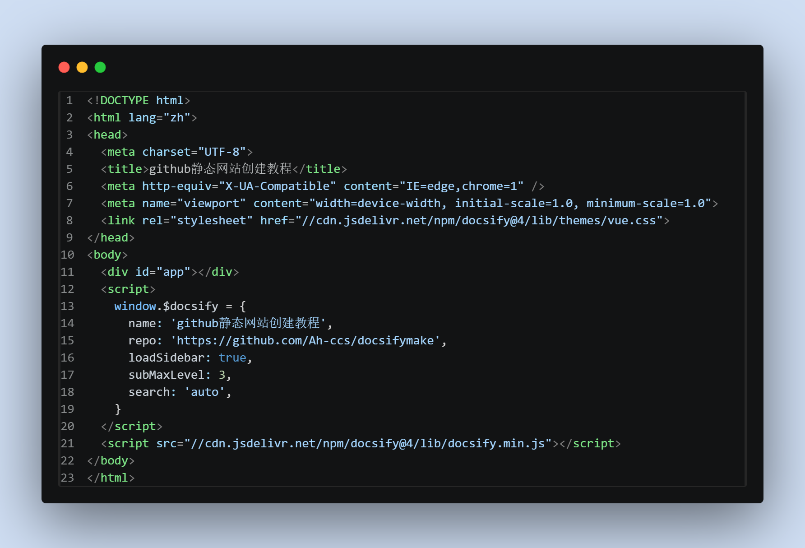

#
# index.html

github仓库的code目录下点击add file

选择create new file

然后赋值进这么一段代码

相应的地方稍微修改一下就好了

# _sidebar.md
创建一个边目录文件 _sidebar.md

边目录文档里面的书写格式可以去搜一下，反正类似

# .nojekyll

创建一个空文件 .nojekyll

来跳过github的默认处理机制，直接发布我们的html文件

这一步不执行网页就不能正常显示

# 最后

最后可以拉取仓库到本地编辑再推送

在actions里面查看推送进度

# 搜索网站

搜索网站的地址就是
<用户名>.github.io/<仓库名>